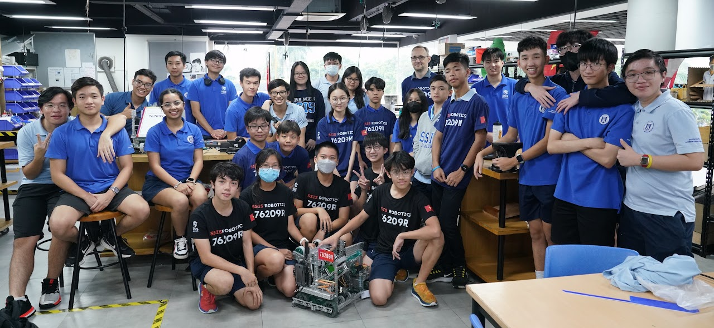
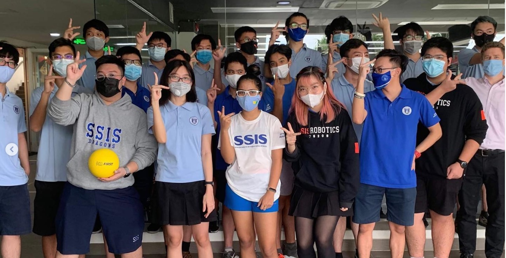

# SSIS Robotics

**Robotics projects since 2016 at Saigon South International School**

## 2023

- [reactivate23](https://github.com/ssis-robotics/reactivate23) The software on the Windows machine was lost, so we had to start from scratch to get a firmware image for the robotRIO and resurrect the FRC robot built by Team 426. By [@flooof](https://github.com/flooof) and [@anhminh1967](https://github.com/anhminh1967)
- [reset23](https://github.com/ssis-robotics/reset23) In a simple hack we disconnected the brain of the Team 426 robot and controlled the CIM motors with the Talon SRX directly with PWM signals from our RC radio to drive an armchair for the art exhibition "RESET" on May 25th, 2023.
- [ssis.bit](https://github.com/ssis-robotics/ssis.bit) AIO microcomputer solution with CircuitPython, display and battery for SSIS students. Got its own [PID in 2023](https://pid.codes/1209/2023/) for the T-Display!
- [VRC-SPIN-UP](https://github.com/ssis-robotics/VRC-SPIN-UP) Building a VEX robot for middle school as team 76209M. And being selected to represent Vietnam at VEX Worlds in Dallas April 2023! By [@flooof](https://github.com/flooof).

## 2022

- [magnet-spinny-thing](https://github.com/ssis-robotics/magnet-spinny-thing) Measure the RPM with a magnetic switch near the spinning gear. By [@Vlak23](https://github.com/Vlak23).
- [Library Robot](https://github.com/ssis-robotics/MakeBlock-UltraSonicSensor) Contribution to the SAMK competition 2022. Made it to the final round! By [@millyng](https://github.com/millyng), [@lolmrdabbydab](https://github.com/lolmrdabbydab) and [@ple22](https://github.com/ple22).
- [rvr](https://github.com/ssis-robotics/rvr) Control the Sphero RVR over the serial interface, using Circuitpython. Written by [@emwdx](https://github.com/emwdx).

  

## 2020

- [Team426Robot](https://github.com/ssis-robotics/Team426Robot) Robot for the 2019-2020 **Inifnite Recharge** challenge of the _First Robotics Competition_ FRC. By [@emwdx](https://github.com/emwdx), [@ZACTF426](https://github.com/ZACTF426), [@LeoNguyen22](https://github.com/LeoNguyen22) and [@NamVo230302](https://github.com/NamVo230302).

  

